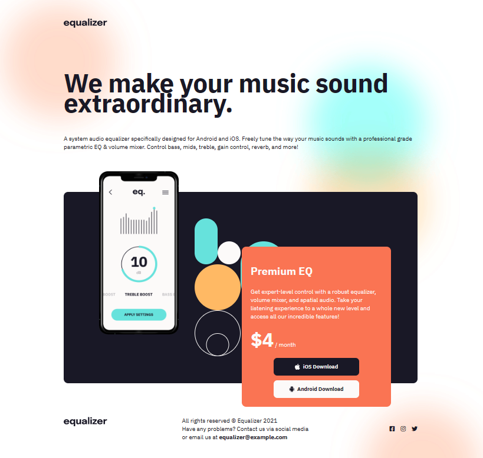

# **DOM Assignment 06**
>**Note**: To complete all the given task.

## **Initial Output**



## Tech Stack


---

## **Task 1**

To change the source of image element in the header section from **equalizer** logo to **ineuron** logo.

### **After Update**


### **Project Solution**

```
const ineuronLogo = document.querySelector("header img");
ineuronLogo.src = "./assets/ineuron-logo.png"
```

---

## **Task 2**

To append a new element in the footer section of **"linkedin logo" after the twitter logo**.

### **After Update**


### **Project Solution**

```
const parent = document.createElement("div");
parent.className = "footer_social_ico";
const child = document.createElement("i");
child.className = "fa-brands fa-linkedin";
const element = document.querySelector(".footer_social");
element.appendChild(parent).appendChild(child);
```

---